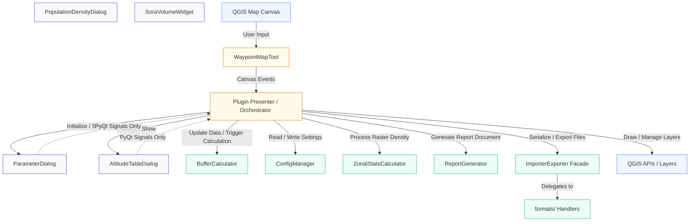

# QUCORE QGIS Plugin: Architecture Analysis (v0.8.1)

This document provides a comprehensive analysis of the macro-structure of the **QUCORE** QGIS plugin codebase following the v0.8.1 refactoring cycle. It maps the end-to-end data flow, defines the public interfaces of each module, and demonstrates the Model-View-Presenter (MVP) architecture.

---

## 1. Architectural Overview & Component Map

The QUCORE plugin is a strictly decoupled QGIS plugin designed to calculate safety volumes (Flight Geography, Contingency Volume, Ground Risk Buffer, Adjacent Area) for unmanned aircraft system (UAS) operations, conforming to EASA / LBA (German Federal Aviation Office) SORA guidelines.

---

## 2. Macro Data Flows

The plugin operates on five primary data flows:

### Flow A: Interactive Waypoint Drawing & Real-Time Buffering
1. **Input**: User clicks/drags on the `QGIS Map Canvas` using the custom `WaypointMapTool` (isolated in `map_tools.py`).
2. **Coordinate Standardizing**: Mouse screen positions are converted to WGS84 coordinates (`EPSG:4326`) and appended to the coordinates list (`self.waypoints`).
3. **Calculation Orchestration**: `DroneCorridorPlanner.rebuild_and_calculate()` copies the active configuration parameters and executes `BufferCalculator.generate_buffers()`.
4. **Spatial Reprojection & Buffering**:
   - Geometries are reprojected from WGS84 to local UTM zones (via `get_utm_epsg(lon, lat)`) to eliminate spatial distortion.
   - For `Corridor` geometries, tapered capsules are computed for each segment and immediately reprojected back to WGS84.
   - For `Polygon` geometries, variable segment buffering or uniform shape buffering is performed.
5. **GUI Update**: The standard geometries (`FG`, `CV`, `GRB`, `AGA`) are pushed to QGIS memory vector layers, styled via color/opacity configurations, and the map canvas refreshes.

### Flow B: Waypoint Parameterization & Custom Altitudes
1. **Access**: User opens the `AltitudeTableDialog`.
2. **Interaction**: The user modifies numerical values (altitude, speed, or corridor width) for specific waypoints.
3. **Cell Processing**: `AltitudeTableDialog.on_cell_changed()` runs `recalculate_buffers(row)` to calculate the safety dimensions locally for that waypoint using `BufferCalculator.calculate_buffer_widths(h, params)`.
4. **Synchronization**: On clicking **Accept**, the updated parameters array is passed back to `plugin.py` via PyQt signals, triggering a full redrawing and recalculation.

### Flow C: Asynchronous Zonal Statistics (Population Density Analysis)
1. **Initiation**: The user launches the `PopulationDensityDialog` (which handles unified spatial analysis for all four buffer zones: Adjacent Area, Ground Risk Buffer, Contingency Volume, and Flight Geography).
2. **Setup**: The dialog compiles local vector layer geometries, reprojects them to the CRS of a selected GHS-POP population density raster layer, and prepares them for processing.
3. **Worker Thread Execution**:
   - The dialog iterates over all active geometries and spawns up to four parallel `ZonalStatsCalculator` tasks using `calculate_async()`.
   - `QgsTask` threads run in the background. Each worker creates a temporary in-memory layer inside its thread, adds features, and executes `QgsZonalStatistics.calculateStatistics()`.
4. **GUI Integration**: Upon completion, tasks independently report population sums, area, and pixel maximums to the main thread via callbacks (`on_completed`). The dialog dynamically updates a central `QTableWidget` to visualize average and maximum densities side-by-side, and stores the values in `self.params`.

### Flow D: Session Serialization & Project Loading
1. **Autosave**: On every non-dragging map change, `serialize_state()` compiles a JSON object containing the waypoints list, pilot position, geometry type, and parameters. This JSON is saved directly into the QGIS Project file using `QgsProject.instance().writeEntry("QUCORE", "state")`.
2. **Reactivation**: When a project is reopened, the plugin reads this string, sanitizes it through `ConfigManager.sanitize_imported_state()`, and restores the visual layers and settings.

### Flow E: Report Generation & File Exports
1. **Preparation**: `plugin.py` takes a snapshot of the QGIS canvas, and renders the 2D SORA volume cross-section widget (`SoraVolumeWidget`) into a temporary PNG image.
2. **Word Export**: `ReportGenerator.export_sora_docx()` reads a template XML/DOCX zip structure (`report_template_de.docx` or `report_template_en.docx`), replaces XML text templates, injects the generated map and cross-section images under `word/media/`, and packs the structure back into a valid Word document.

---

## 3. Core Module Interfaces

### `config_manager.py`
Provides a strict validation and clamp wrapper around raw parameters.
- `ConfigManager.get_instance()`: Returns the singleton instance.
- `ConfigManager.get_default_params()`: Returns a copy of the default parameters dictionary.
- `ConfigManager.get_param(params_dict, key)`: Returns the value of `key` from `params_dict`. If missing, falls back to `config.json` defaults. Automatically clamps values according to bounds loaded from `config_limits.json`.

### `buffer_calculator.py`
The mathematical engine, completely decoupled from QGIS GUI.
- `BufferCalculator.calculate_buffer_widths(h, params)`: Calculates buffer radii `(r_fg, r_cv, r_grb, h_cv, d_grb)` for a single flight height $h$ based on the input parameters. It computes an additional asymmetric wind-drift vector `d_grb` to shift the GRB based on wind velocity and parachute fall time.
- `BufferCalculator.generate_buffers(waypoints, params, geometry_type)`: Generates and returns a tuple of WGS84 geometries: `(fg_geom, cv_geom, grb_geom, aga_geom)`. The GRB geometry applies an asymmetric translation in UTM-space and falls back to a union with FG to limit Luv shrinking.

### `importer_exporter.py` & `formats/`
A clean Facade module that delegates all spatial format serialization to specific handler modules.
- `KmlHandler`: Imports/exports standard KML files.
- `GeoJsonHandler`: Imports/exports GeoJSON formats.
- `DipulHandler`: Imports/exports `.dipul` JSON schemas.
- `FlightplanHandler`: Imports/exports SkyDemon `.flightplan` structures.
- `ArduPilotHandler`: Exports QGroundControl `.plan` and Ardupilot `.waypoints` mission/geofence files.

### `map_tools.py`
Houses `WaypointMapTool`, bridging the QGIS canvas and the presenter without hard dependencies on `plugin.py`. Uses dependency injected callbacks to transmit coordinates.

### `report_generator.py`
Handles Word report serialization and template substitution. Uses a zero-dependency string-replacement approach for XML files inside zipped `.docx` structures.

---

## 4. Resolved Structural Couplings (v0.8.0 Refactoring)

In version 0.8.0, the codebase underwent a massive architectural overhaul to resolve several legacy "God Object" and tight-coupling issues:

1. **Config Decoupling**: Default parameter resolution no longer requires heavy GUI instantiation of `ParameterDialog`. `plugin.py` and `advanced_settings_dialog.py` now query `ConfigManager` directly, cutting overhead during headless testing.
2. **Dumb Views (Dialog Separation)**: The `AltitudeTableDialog` was completely decoupled from the QGIS Map Canvas. It no longer injects text labels or vertex markers itself; it simply emits native PyQt signals (`sigWaypointFocused`, `sigToggleWaypointLabels`) that the main `DroneCorridorPlanner` presenter intercepts and processes.
3. **Map Tool Extraction**: `WaypointMapTool` was extracted from the monolithic `plugin.py` into `map_tools.py` using weak references and callback injection to prevent memory leaks and circular dependencies.
4. **Importer/Exporter Decomposing**: The 1,400+ line `importer_exporter.py` module was broken down into a sleek Facade pattern. The actual parsing logic is now strictly isolated by file extension into the `formats/` sub-package.
5. **Unified Async Workflows**: The `PopulationDensityDialog` was rewritten to utilize dynamic GUI updates (via `QTableWidget`) and parallel task spawner factories (`create_task`), eliminating hardcoded layouts and unifying analysis across all volumetric zones (AA, GRB, CV, FG).
