# QUCORE QGIS Plugin: Architecture Analysis (v1.0.2)

This document provides a comprehensive analysis of the macro-structure of the **QUCORE** (QGIS UAS Corridor Outlining & Routing Engine) plugin codebase following the v0.9.0 release cycle and the cross-platform / QGIS 4.x compatibility audit. It maps the end-to-end data flow, defines the public interfaces of each module, and demonstrates the decoupled Model-View-Presenter (MVP) architecture.

---

## 1. Architectural Overview & Component Map

The QUCORE plugin is a strictly decoupled QGIS plugin designed to calculate safety volumes (Flight Geography, Contingency Volume, Ground Risk Buffer, Adjacent Area) for unmanned aircraft system (UAS) operations, conforming to EASA / LBA (German Federal Aviation Office) SORA guidelines.

```mermaid
graph TD
    classDef model fill:#ecfdf5,stroke:#10b981,stroke-width:1px;
    classDef view fill:#f9f9fb,stroke:#4f46e5,stroke-width:1px;
    classDef presenter fill:#fffbeb,stroke:#d97706,stroke-width:1px;
    classDef ext fill:#eff6ff,stroke:#3b82f6,stroke-width:1px;

    %% Presenter Layer (Orchestration)
    Presenter[Plugin Presenter / Orchestrator <plugin.py>]:::presenter
    MapTool[WaypointMapTool <map_tools.py>]:::presenter

    %% View Layer (UI Only - Dumb Components)
    ParamDlg[ParameterDialog]:::view
    AltDlg[AltitudeTableDialog]:::view
    PopDlg[PopulationDensityDialog]:::view
    WindDlg[AsymmetricBufferWinddriftDialog]:::view
    ExpDlg[ExportSettingsDialog]:::view
    VlosDlg[VlosCalculatorDialog]:::view
    AdvDlg[AdvancedSettingsDialog]:::view
    InfoDlg[AboutDialog / FormatsInfoDialog <info_dialogs.py>]:::view
    SoraWidget[SoraVolumeWidget]:::view

    %% Model Layer (Pure Logic & Data - Decoupled)
    BufCalc[BufferCalculator]:::model
    ConfMgr[ConfigManager]:::model
    TrMgr[TranslationManager]:::model
    ZonalStats[ZonalStatsCalculator]:::model
    ReportGen[ReportGenerator]:::model
    ImpExp[ImporterExporter Facade]:::model
    Fmts[formats/ Handlers: Kml, GeoJson, Dipul, Flightplan, ArduPilot]:::model

    %% External Systems
    Canvas[QGIS Map Canvas]:::ext
    QGIS[QGIS APIs / Layers]:::ext

    %% Connections
    Canvas -->|User Input| MapTool
    MapTool -->|Canvas Events| Presenter
    Presenter -->|Draw / Manage Layers| QGIS
    Presenter -->|Update Data / Trigger Calculation| BufCalc
    Presenter -->|Read / Write Settings| ConfMgr
    Presenter -->|Resolve Localized Strings| TrMgr
    Presenter -->|Initialize / Show| ParamDlg
    Presenter -->|Initialize / Show| AltDlg
    Presenter -->|Initialize / Show| WindDlg
    Presenter -->|Initialize / Show| ExpDlg
    Presenter -->|Initialize / Show| VlosDlg
    Presenter -->|Initialize / Show| AdvDlg
    Presenter -->|Initialize / Show| InfoDlg
    
    AltDlg -.->|PyQt Signals Only| Presenter
    ParamDlg -.->|PyQt Signals Only| Presenter
    WindDlg -.->|PyQt Signals Only| Presenter
    AdvDlg -.->|PyQt Signals Only| Presenter
    
    Presenter -->|Process Raster Density| ZonalStats
    Presenter -->|Generate Report Document| ReportGen
    Presenter -->|Serialize / Export Files| ImpExp
    ImpExp -->|Delegates to| Fmts
```

---

## 2. Macro Data Flows

The plugin operates on five primary data flows:

### Flow A: Interactive Waypoint Drawing & Real-Time Buffering
1. **Input**: User clicks/drags on the `QGIS Map Canvas` using the custom `WaypointMapTool` (isolated in `map_tools.py`).
2. **Coordinate Standardizing**: Mouse screen positions are converted to WGS84 coordinates (`EPSG:4326`) and appended to the coordinates list (`self.waypoints`).
3. **Calculation Orchestration**: `DroneCorridorPlanner.rebuild_and_calculate()` copies the active configuration parameters and executes `BufferCalculator.generate_buffers()`.
4. **Spatial Reprojection & Buffering**:
   - Geometries are reprojected from WGS84 to local UTM zones (via `get_utm_epsg(lon, lat)`) to eliminate spatial distortion.
   - For `Corridor` geometries, tapered capsules are computed for each segment and immediately reprojected back to WGS84.
   - For `Polygon` geometries, variable segment buffering or uniform shape buffering is performed.
   - When asymmetric wind drift is enabled, an envelope calculation adjusts the Ground Risk Buffer (GRB) according to wind direction, velocity bounds, and parachute descent rate.
5. **GUI Update**: The standard geometries (`FG`, `CV`, `GRB`, `AGA`) are pushed to QGIS memory vector layers, styled via color/opacity configurations, and the map canvas refreshes.

### Flow B: Waypoint Parameterization & Custom Altitudes
1. **Access**: User opens the `AltitudeTableDialog`.
2. **Interaction**: The user modifies numerical values (altitude, speed, or corridor width) for specific waypoints.
3. **Cell Processing**: `AltitudeTableDialog.on_cell_changed()` runs `recalculate_buffers(row)` to calculate the safety dimensions locally for that waypoint using `BufferCalculator.calculate_buffer_widths(h, params)`.
4. **Synchronization**: On clicking **Accept**, the updated parameters array is passed back to `plugin.py` via PyQt signals, triggering a full redrawing and recalculation.

### Flow C: Asynchronous Zonal Statistics (Population Density Analysis)
1. **Initiation**: The user launches the `PopulationDensityDialog` (which handles unified spatial analysis for all four buffer zones: Adjacent Area, Ground Risk Buffer, Contingency Volume, and Flight Geography).
2. **Setup**: The dialog compiles local vector layer geometries, reprojects them to the CRS of a selected GHS-POP population density raster layer, and prepares them for processing.
3. **Worker Thread Execution**:
   - The dialog iterates over all active geometries and spawns up to four parallel `ZonalStatsCalculator` tasks using `calculate_async()`.
   - `QgsTask` threads run in the background. Each worker creates a temporary in-memory layer inside its thread, adds features, and executes `QgsZonalStatistics.calculateStatistics()`.
4. **GUI Integration**: Upon completion, tasks independently report population sums, area, and pixel maximums to the main thread via callbacks (`on_completed`). The dialog dynamically updates a central `QTableWidget` to visualize average and maximum densities side-by-side, and stores the values in `self.params`.

### Flow D: Session Serialization & Project Loading
1. **Autosave**: On every non-dragging map change, `serialize_state()` compiles a JSON object containing the waypoints list, pilot position, geometry type, and parameters. This JSON is saved directly into the QGIS Project file using `QgsProject.instance().writeEntry("QUCORE", "state")`.
2. **Reactivation**: When a project is reopened, the plugin reads this string, sanitizes it through `ConfigManager.sanitize_imported_state()`, and restores the visual layers and settings.

### Flow E: Report Generation & File Exports
1. **Preparation**: `plugin.py` takes a snapshot of the QGIS canvas, and renders the 2D SORA volume cross-section widget (`SoraVolumeWidget`) into a temporary PNG image.
2. **Word Export**: `ReportGenerator.export_sora_docx()` reads a template XML/DOCX zip structure (`report_template_de.docx` or `report_template_en.docx`), replaces XML text templates, injects the generated map and cross-section images under `word/media/`, and packs the structure back into a valid Word document.

---

## 3. Core Module Interfaces

### `config_manager.py` & JSON Schemas
Provides a strict validation and clamp wrapper around raw parameters, preventing magic numbers in UI code:
- `ConfigManager.get_instance()`: Returns the singleton instance.
- `ConfigManager.get_default_params()`: Returns a copy of the default parameters dictionary from `config.json`.
- `ConfigManager.get_default(key)`: Returns default fallback value for a specific key.
- `ConfigManager.get_limit(key)`: Returns the schema-defined bounds (`min`, `max`, `step`, `decimals`) from `config_limits.json`.
- `ConfigManager.get_param(params_dict, key)`: Returns the value of `key` from `params_dict`. If missing, falls back to `config.json` defaults. Automatically clamps values according to bounds loaded from `config_limits.json`.

### `translation_manager.py` & `translations.json`
Provides a decoupled internationalization service:
- `TranslationManager.tr(key, lang="de", default="")`: Resolves localized strings dynamically.
- `translations.json`: Centralized translation catalog covering all UI elements, labels, dialog titles, table headers, and error messages in German and English.

### `buffer_calculator.py`
The mathematical engine, completely decoupled from QGIS GUI.
- `BufferCalculator.calculate_buffer_widths(h, params)`: Calculates buffer radii `(r_fg, r_cv, r_grb, h_cv, d_grb)` for a single flight height $h$ based on the input parameters. It computes an additional asymmetric wind-drift vector `d_grb` to shift the GRB based on wind velocity and parachute fall time.
- `BufferCalculator.generate_buffers(waypoints, params, geometry_type)`: Generates and returns a tuple of WGS84 geometries: `(fg_geom, cv_geom, grb_geom, aga_geom)`. The GRB geometry applies an asymmetric translation in UTM-space and falls back to a union with FG to limit Luv shrinking.

### `asymmetric_buffer_winddrift_dialog.py`
Dedicated interactive view component featuring a real-time `WindCompassWidget` for configuring wind velocity bounds, wind direction variance, and parachute descent metrics for asymmetric Ground Risk Buffer calculations.

### `importer_exporter.py` & `formats/`
A clean Facade module that delegates all spatial format serialization to specific handler modules:
- `KmlHandler`: Imports/exports standard KML files.
- `GeoJsonHandler`: Imports/exports GeoJSON formats.
- `DipulHandler`: Imports/exports `.dipul` JSON schemas.
- `FlightplanHandler`: Imports/exports SkyDemon `.flightplan` structures.
- `ArduPilotHandler`: Imports and exports QGroundControl `.plan` and MissionPlanner / Ardupilot `.waypoints` mission files, with explicit filtering of unneeded MAVLink commands and fence exclusions to protect the integrity of QUCORE's generated safety volumes.

### `info_dialogs.py`
Contains the static information views (`AboutDialog` and `FormatsInfoDialog`), including license verification UI, trial tracker, and format capability comparison matrix.

### `map_tools.py`
Houses `WaypointMapTool`, bridging the QGIS canvas and the presenter without hard dependencies on `plugin.py`. Uses dependency injected callbacks to transmit coordinates.

### `dialog_utils.py`
Provides `QucoreBaseDialog`, a unified base dialog class that manages window geometry persistence (`saveGeometry()` / `restoreGeometry()`) via `QgsSettings`, screens boundary validation against disconnected external monitors, and centralized reset-to-defaults capabilities across all UI dialogs.

### `report_generator.py`
Handles Word report serialization and template substitution. Uses a zero-dependency string-replacement approach for XML files inside zipped `.docx` structures.

---

## 4. Cross-Platform & Dual-Version Architecture (QGIS 3.x LTR & QGIS 4.x / Qt6)

Following the comprehensive macOS / QGIS 4 porting audit, QUCORE strictly implements dual-version compatibility patterns that operate identically on **QGIS 3.38 – 3.44+ LTR (PyQt5 / Qt 5.15)** and **QGIS 4.x (PyQt6 / Qt 6.x)** across Windows, macOS, and Linux:

1. **Unified Qt Abstraction via `qgis.PyQt`**:
   - Direct `from PyQt5 import ...` statements are completely prohibited across the codebase.
   - All modules import through QGIS's official shim (`from qgis.PyQt.QtWidgets import ...`, `from qgis.PyQt.QtCore import ...`, `from qgis.PyQt.QtGui import ...`, `from qgis.PyQt.QtXml import ...`, `from qgis.PyQt import sip`).
2. **Fully Qualified Scoped Enums**:
   - Enums are accessed via full scope paths (e.g., `Qt.AlignmentFlag.AlignCenter`, `QDialogButtonBox.StandardButton.Ok`, `QMessageBox.StandardButton.Yes`, `QTableWidget.EditTrigger.NoEditTriggers`, `QHeaderView.ResizeMode.Stretch`, `QPainter.RenderHint.Antialiasing`, `QPen.PenStyle.DashLine`, `QBrush.BrushStyle.NoBrush`, `Qt.CursorShape.WaitCursor`, `QMetaType.Type.QString`).
   - Valid in PyQt 5.12+ and mandatory in PyQt6.
3. **Modern API Methods**:
   - Replaced deprecated `.exec_()` with standard Python 3 `.exec()`.
   - Replaced removed `QgsMapMouseEvent.pos()` with `event.pixelPoint()`.
4. **macOS Floating Tool Window Menu Decoupling**:
   - On macOS, Qt binds `QMenuBar` to the global system bar by default, but ignores floating `Qt.WindowType.Tool` windows (resulting in invisible 0-height menus).
   - In `plugin.py`, `self.menu_bar.setNativeMenuBar(False)` is explicitly enforced, guaranteeing that the menu ribbon is rendered inside the tool window across all operating systems.
5. **Clean Type Handling**:
   - `QFont("Arial", 9, QFont.Weight.Normal, True)` correctly specifies font weight (3rd argument) and italic boolean (4th argument), preventing runtime `TypeError` under strict Qt6 signatures.
6. **Robust Dynamic Module Resolution**:
   - Format handlers dynamically resolve `BufferCalculator.__module__` when altering global calculation parameters (such as `BUFFER_SEGMENTS`), preventing coupling to specific folder or package names (`QUCORE`, `QUCORE-main`).

---

## 5. Resolved Structural Couplings (v0.8.0 - v0.9.0 Refactoring)

1. **Config Decoupling**: Default parameter resolution queries `ConfigManager` directly, eliminating heavy GUI instantiation during background tasks and unit testing.
2. **Dumb Views (Dialog Separation)**: All dialogs are decoupled from the QGIS Map Canvas, communicating strictly via native PyQt signals.
3. **Info Dialog Extraction**: `AboutDialog` and `FormatsInfoDialog` reside in `info_dialogs.py`.
4. **Map Tool Extraction**: `WaypointMapTool` in `map_tools.py` uses callback injection to prevent memory leaks and circular dependencies.
5. **Importer/Exporter Facade**: Monolithic export logic is cleanly decomposed into specialized format handlers under `formats/`.
6. **Unified Async Workflows**: `PopulationDensityDialog` utilizes parallel background `QgsTask` workers for non-blocking spatial computation.
